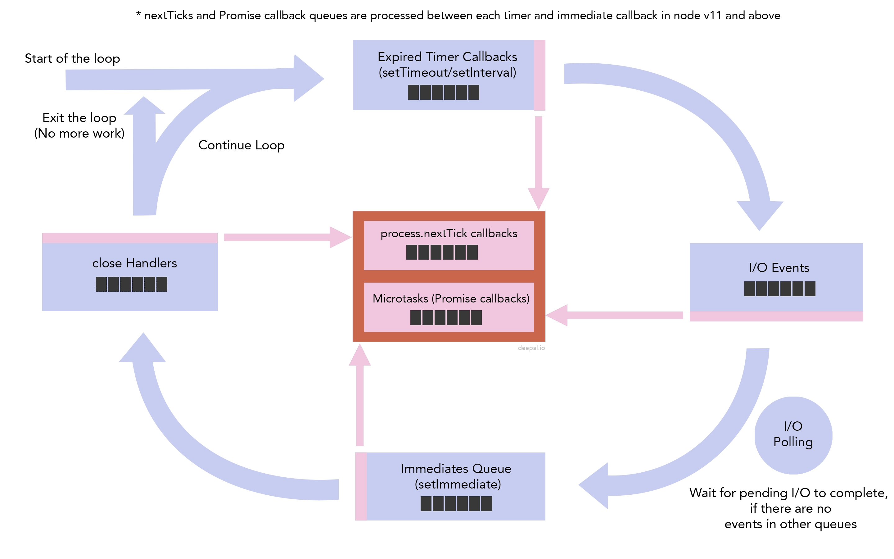

# 2020-03-14 - Week 1

* Event loop example
    * 
    * Promises:
        * Native promises: https://javascript.info/microtask-queue
        * Q: https://github.com/kriskowal/q
        * Bluebird: https://github.com/petkaantonov/bluebird/
    * Почитать: https://nodejs.org/ru/docs/guides/dont-block-the-event-loop/
    * Посмотреть: https://www.youtube.com/watch?v=PNa9OMajw9w
* Когда читать файлы синхронно (readFileSync)
    * https://github.com/dwyl/sendemail/blob/582eb5b7d865959d569be50dc6fb84ca146c2ad1/lib/index.js#L38
* Тестирование fs